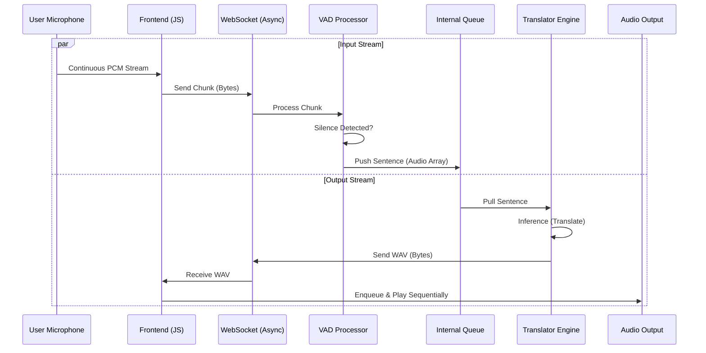

# Technical Design: Continuous Duplex Pipeline

## 1. Introduction

This document describes the technical architecture and design for the **Continuous Duplex Pipeline** (Simultaneous Translation). The goal is to enable a full-duplex communication mode where the user can speak continuously while the system translates and plays back previous sentences in parallel. This replaces the existing half-duplex (blocking) "walkie-talkie" mechanism.

## 2. System Architecture

The architecture shifts from a synchronous **Request-Response** loop to an asynchronous **Producer-Consumer** pattern on both the backend and frontend.

### 2.1 High-Level Component Diagram



### 2.2 Key Changes

| Component | Current State (Half-Duplex) | New State (Full-Duplex) |
| :--- | :--- | :--- |
| **Frontend Mic** | Paused during playback | **Always On** |
| **Frontend Playback** | Immediate `play()` | **FIFO Queue** (`AudioQueue`) |
| **Backend Loop** | `while True: read -> process -> send` | **Split Tasks:** `ReceiverTask` & `SenderTask` |
| **Concurrency** | Single Thread / Blocking | **Asyncio** + **ThreadExecutor** (for GPU) |

---

## 3. Component Design

### 3.1 Backend: Asynchronous Producer-Consumer (`src/api/main.py`)

The single `while True` loop in the WebSocket endpoint will be replaced by two concurrent asynchronous tasks coordinated via an `asyncio.Queue`.

#### 3.1.1 The Queue
*   **Type:** `asyncio.Queue`
*   **Content:** `numpy.ndarray` (Audio samples of a complete sentence) or `None` (Sentinel for termination).

#### 3.1.2 Producer Task (`input_loop`)
*   **Responsibility:** Read audio chunks from WebSocket, feed VAD, push detected sentences to Queue.
*   **Logic:**
    ```python
    while True:
        data = await websocket.receive_bytes()
        sentence = vad.process(data)
        if sentence:
            await queue.put(sentence)
    ```

#### 3.1.3 Consumer Task (`translation_loop`)
*   **Responsibility:** Pull sentences from Queue, run heavy Translation inference, send result back.
*   **Concurrency Note:** Since `translator.translate` is CPU/GPU bound and blocking, running it directly would block the `input_loop`. We must wrap it in `run_in_executor` to keep the Event Loop responsive for incoming audio.
*   **Logic:**
    ```python
    while True:
        sentence = await queue.get()
        # Run blocking inference in a thread
        loop = asyncio.get_running_loop()
        wav_bytes = await loop.run_in_executor(None, translator.translate, sentence, tgt_lang)
        await websocket.send_bytes(wav_bytes)
        queue.task_done()
    ```

### 3.2 Frontend: Audio Queue Manager (`static/index.html`)

To prevent audio overlap when multiple translations arrive in quick succession, we implement a client-side queue.

#### 3.2.1 Audio Queue Logic
*   **Structure:** A generic Array/List holding `ArrayBuffer` data.
*   **State:** `isPlaying` (boolean).
*   **Flow:**
    1.  `socket.onmessage` receives data -> Pushes to `queue`.
    2.  Calls `processQueue()`.
    3.  `processQueue()` checks `isPlaying`. If `true`, return.
    4.  If `false` and queue has items:
        *   Set `isPlaying = true`.
        *   Shift item from `queue`.
        *   Decode and Play.
        *   On `ended` event -> Set `isPlaying = false` -> Call `processQueue()` recursively.

---

## 4. Data Models & API Interface

### 4.1 WebSocket Protocol
The protocol remains **Binary-First** for efficiency, but logic changes on how messages are handled.

*   **Client -> Server:** Continuous stream of Float32 PCM bytes.
*   **Server -> Client:** Asynchronous stream of WAV bytes.
*   **Query Parameters:** `/ws/translate?tgt_lang=xx` (Existing).

### 4.2 Error Handling
*   **Input Error:** If WebSocket disconnects in `input_loop`, the `queue` must be drained or poisoned (sentinel) to stop the `translation_loop`.
*   **Translation Error:** If the model fails, an error log is generated. Ideally, a specific "error sound" or message could be sent, but for MVP we log and skip.

---

## 5. Security & Performance Considerations

### 5.1 Performance (Latency)
*   **GIL (Global Interpreter Lock):** Using `run_in_executor` is crucial. If the Translator blocks the main thread, the VAD processor won't receive new chunks, leading to buffer overflows or dropped audio.
*   **Queue Size:** We will not limit the queue size initially (`maxsize=0`), but we should monitor for memory growth if the user speaks faster than the GPU can translate (Real-Time Factor > 1).

### 5.2 Thread Safety
*   **VAD Processor:** Is stateful. It is only accessed by the `input_loop`, so it remains thread-safe within that context.
*   **Translator Engine:** Is stateless per request (mostly), but uses shared GPU resources. CUDA is generally thread-safe for sequential calls, but `run_in_executor` ensures we serialize access if we only have one worker.

### 5.3 Acoustic Feedback
*   **Risk:** Microphone picking up Speaker output.
*   **Mitigation:** User education (UI Warning: "Please use Headphones"). No software AEC (Acoustic Echo Cancellation) in MVP.

---

## 6. Implementation Plan

1.  **Backend Refactoring:**
    *   Import `asyncio`.
    *   Split `websocket_endpoint` into `receive` and `process` functions.
    *   Implement `run_in_executor` for translation.
2.  **Frontend Update:**
    *   Create `class AudioPlayerQueue`.
    *   Update `ws.onmessage` to use queue.
    *   Remove `stopRecording()` logic on playback.
3.  **Testing:**
    *   Test with long continuous speech (counting 1 to 20).
    *   Verify ordering of outputs.

---

## 7. Open Questions / Risks
*   **Risk:** If the user speaks extremely fast, the output queue might lag significantly (10s+ delay).
*   **Mitigation:** Future features could implement a "Speed Up" logic (time stretching) or "Summarization" if lag > 10s. (Out of scope for this spec).
