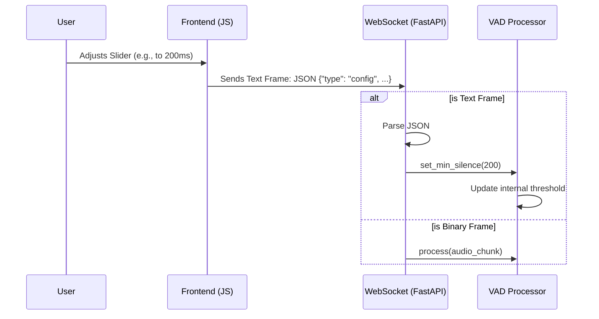

# Technical Design: Dynamic VAD Sensitivity

## 1. Introduction

This document describes the technical implementation of **Dynamic VAD Sensitivity** adjustment. It details how the frontend will communicate configuration changes to the backend via a hybrid WebSocket protocol and how the backend will apply these changes to the active Voice Activity Detector (VAD) instance in real-time.

## 2. System Architecture

The architecture builds upon the existing WebSocket connection. Instead of treating the connection as a pure binary stream, we introduce a message type discriminator.

### 2.1 Component Interaction Diagram



---

## 3. Component Design

### 3.1 Backend: Hybrid Protocol Handler (`src/api/main.py`)

The WebSocket endpoint currently waits for `websocket.receive_bytes()`. This must be changed to `websocket.receive()`, which returns a generic message that can be bytes or text.

#### 3.1.1 Receive Logic
```python
while True:
    message = await websocket.receive()
    
    if "bytes" in message:
        # Existing audio logic
        data = message["bytes"]
        sentence = vad.process(data)
        # ... processing ...

    elif "text" in message:
        # New config logic
        try:
            payload = json.loads(message["text"])
            if payload.get("type") == "config":
                min_silence = payload.get("min_silence_ms")
                if min_silence:
                    vad.set_min_silence(int(min_silence))
        except Exception as e:
            logger.warning(f"Invalid config message: {e}")
```

### 3.2 Backend: VAD Processor Update (`src/core/vad_processor.py`)

The `VADProcessor` wraps the `VADIterator` from the Silero library. We need to update the configuration of the *running* iterator.

#### 3.2.1 `set_min_silence` Method
*   **Input:** `ms` (int)
*   **Validation:** Ensure `ms >= 0`.
*   **Logic:**
    1. Update `self.min_silence_ms`.
    2. Recalculate `self.iterator.min_silence_samples` = `ms * sample_rate / 1000`.
    3. Update `self.iterator.speech_pad_samples` = `ms * sample_rate / 1000` (Silero VAD often uses padding equal to silence duration for smoothing, we should check if this is desired, or just update the silence trigger).
    *   *Correction:* In Silero `VADIterator`, `min_silence_samples` is the key property controlling the "end of speech" trigger. We will update strictly this property.

### 3.3 Frontend: UI & Event Logic (`static/index.html`)

#### 3.3.1 UI Elements
*   **Slider:** `<input type="range" min="200" max="2000" step="100" value="500">`
*   **Label:** Display current value (e.g., "500 ms").

#### 3.3.2 Event Handling
*   **Event:** `input` (real-time dragging) or `change` (on release).
    *   *Decision:* Use `change` (on release) to avoid flooding the WebSocket with hundreds of updates while dragging.
*   **Action:**
    ```javascript
    const config = {
        type: "config",
        min_silence_ms: parseInt(slider.value)
    };
    ws.send(JSON.stringify(config));
    ```

---

## 4. Data Models & API Interface

### 4.1 Configuration Message (JSON)

**Schema:**
```json
{
  "type": "config",
  "min_silence_ms": <integer, required, range: 100-5000>
}
```

**Example:**
```json
{
  "type": "config",
  "min_silence_ms": 300
}
```

---

## 5. Security & Performance Considerations

### 5.1 Input Validation
The backend must validate `min_silence_ms` to prevent integer overflows or negative values that could crash the VAD math.
*   **Range:** Clamp between `100` (min safe) and `5000` (max reasonable).

### 5.2 Thread Safety
Since the VAD processor is accessed sequentially within the WebSocket loop (even in the async version), updating a property is atomic enough in Python. No complex locking is required unless we move to multi-threaded processing later (Extension 2), but even then, the VAD state is owned by the input loop.

---

## 6. Implementation Plan

1.  **Backend:** Add `set_min_silence` to `VADProcessor`.
2.  **Backend:** Update `websocket_endpoint` to handle text messages.
3.  **Frontend:** Add Slider HTML and JS logic.
4.  **Testing:** Verify "Fast" vs "Slow" settings.
