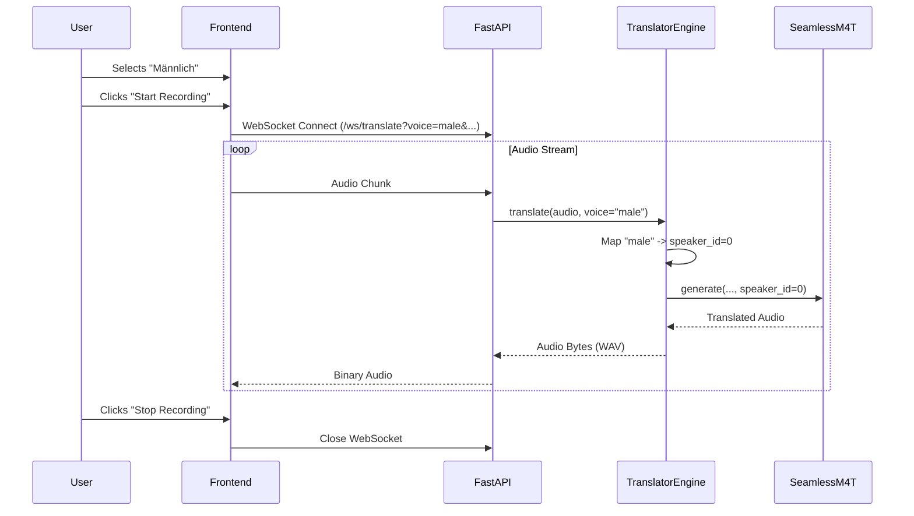

# Technical Design: Manual Voice Selection (Speaker Identity)

**Version:** 1.0
**Date:** 2026-02-10
**Author:** Gemini
**Related Documents:** [ADR-0004](docs/adr/ADR-0003-manual-voice-selection.md), [DEV_SPEC-0004](docs/tasks/DEV_SPEC-0004-manual-voice-selection.md)

---

### 1. Introduction

This document provides a detailed technical design for the manual voice selection feature. It translates the requirements defined in DEV_SPEC-0004 into a concrete implementation plan, specifying the architecture, components, and API changes. The goal is to allow users to force the translation output to use a specific voice (Male/Female) or stick to the default automatic preservation.

---

### 2. System Architecture and Components

#### 2.1. Component Overview

*   **Frontend (index.html / JavaScript):**
    *   Adds a new dropdown menu (`#voice-select`) to the UI.
    *   Capture the selected voice preference and pass it to the backend via WebSocket query parameters.
    *   Manage UI state (disabling the dropdown during active recording).

*   **Backend (FastAPI / main.py):**
    *   Updates the `/ws/translate` endpoint to accept a `voice` query parameter.
    *   Passes the `voice` preference down to the translation service layer.

*   **Inference Layer (translator_engine.py):**
    *   Implements the logic to map voice strings ("male", "female", "auto") to model-specific parameters.
    *   Uses the `speaker_id` parameter in the `SeamlessM4Tv2Model.generate` method.

#### 2.2. Component Interaction Diagram

This diagram illustrates the flow of the voice selection from the UI to the model.



---

### 3. Data Model Specification

No persistent data models are required for this feature. The voice selection is transient and scoped to the WebSocket session.

**Voice Mapping:**
| User Selection | Parameter Value | Internal `speaker_id` |
| :--- | :--- | :--- |
| Auto-Erkennung | `auto` | `None` (Model default) |
| Männlich | `male` | `0` (Tentative - to be validated) |
| Weiblich | `female` | `1` (Tentative - to be validated) |

---

### 4. Backend Specification

#### 4.1. API Endpoints

**WebSocket: `/ws/translate`**
*   **Query Parameters:**
    *   `src_lang` (string): Source language code.
    *   `tgt_lang` (string): Target language code.
    *   `voice` (string, optional): One of `["auto", "male", "female"]`. Defaults to `auto`.

#### 4.2. Service Layer (`translator_engine.py`)

The `translate` method signature will be updated to handle the `voice` parameter.

```python
def translate(self, audio_np: np.ndarray, tgt_lang: str = None, src_lang: str = None, voice: str = "auto") -> bytes:
    # ... mapping logic ...
    spkr_id = self.map_voice_to_id(voice)
    
    # ... inference ...
    output_tokens = self.model.generate(
        **audio_inputs,
        tgt_lang=target,
        generate_speech=True,
        speaker_id=spkr_id
    )
```

---

### 5. Frontend Specification

#### 5.1. Voice Selection Dropdown

A new dropdown will be added to the control row in `index.html`.

#### 5.2. State Management

The JavaScript `startRecording` and `stopRecording` functions will be updated to:
1.  Read the value from `document.getElementById('voice-select').value`.
2.  Include `&voice=${voice}` in the WebSocket URL.
3.  Set `disabled = true` on the dropdown while recording, and `false` when stopped.

---

### 6. Security Considerations

*   **Parameter Validation:** The backend must validate that the `voice` parameter is one of the expected values. If an invalid value is provided, it should default to `"auto"`.

---

### 7. Performance Considerations

*   **Inference Latency:** Using a fixed `speaker_id` does not increase inference time. In fact, it might slightly reduce the internal overhead as the model doesn't have to compute embeddings from the source audio for every segment.
