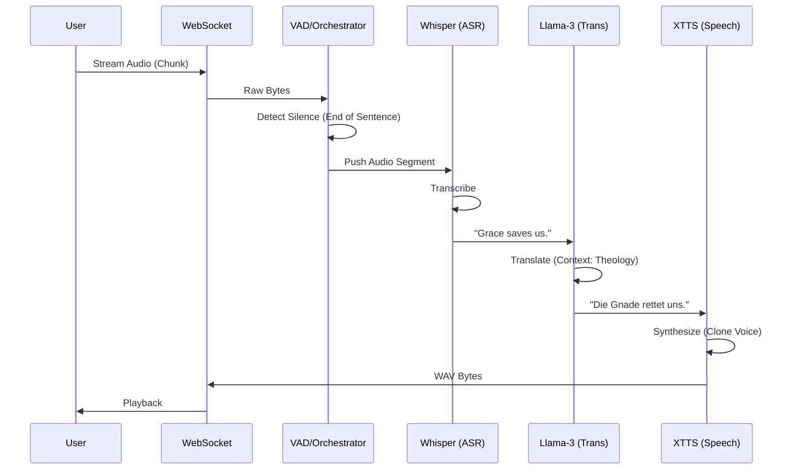

# Technical Design: Modular "Green-Field" Pipeline (The Modular Trinity)

**Version:** 1.0
**Date:** 2026-02-10
**Author:** Gemini
**Related Documents:** [ADR-0006](docs/adr/ADR-0006-modular-pipeline-architecture.md), [DEV_SPEC-0006](docs/tasks/DEV_SPEC-0006-modular-pipeline-architecture.md)

---

### 1. Introduction

This document provides a detailed technical design for the "Modular Trinity" architecture. It translates the requirements defined in DEV_SPEC-0006 into a concrete implementation plan, specifying the component architecture, data flow, and interfaces for the ASR (Whisper), LLM (Llama-3), and TTS (XTTS v2) modules. The goal is to achieve high theological accuracy and authentic voice cloning while maintaining acceptable local latency.

---

### 2. System Architecture and Components

The system adopts a **Micro-Modular Architecture** within a single Python process, orchestrated via `asyncio`. This avoids the overhead of inter-process communication (IPC) while keeping components decoupled.

#### 2.1. Component Overview

*   **Frontend (HTML/JS):**
    *   WebSocket client that streams raw audio (PCM Float32, 16kHz).
    *   Handles UI for "Calibration" (uploading a 6s reference WAV for cloning).
    *   Receives synthesized audio chunks for playback.

*   **Backend (`src/pipeline/orchestrator.py`):**
    *   Central hub that manages the lifecycle of the three core engines.
    *   Uses `asyncio.Queue` to buffer data between stages: `AudioQueue` -> `TextQueue` -> `TranslationQueue` -> `SpeechQueue`.

*   **Core Modules:**
    1.  **ASR Engine (`src/core/asr/whisper_engine.py`):**
        *   Wraps `faster-whisper`.
        *   Processes raw audio chunks + VAD.
        *   Emits: `TranscriptionResult`.
    2.  **LLM Engine (`src/core/llm/llama_engine.py`):**
        *   Wraps `llama-cpp-python`.
        *   Applies System Prompt & Glossary.
        *   Emits: `TranslationResult`.
    3.  **TTS Engine (`src/core/tts/xtts_engine.py`):**
        *   Wraps `TTS` (Coqui) or direct inference.
        *   Uses Speaker Embeddings (latents) for cloning.
        *   Emits: `SynthesisResult` (WAV bytes).

#### 2.2. Component Interaction Diagram



---

### 3. Data Model Specification

Python `dataclasses` will be used to enforce type safety between modules.

#### 3.1. Audio Segment
```python
@dataclass
class AudioSegment:
    data: np.ndarray          # Float32, 16kHz
    sample_rate: int = 16000
    timestamp: float          # Unix timestamp of capture
    is_calibration: bool = False
```

#### 3.2. Transcription Result
```python
@dataclass
class TranscriptionResult:
    text: str
    language: str             # ISO code (e.g., "en")
    confidence: float         # 0.0 - 1.0
    start_time: float
    end_time: float
```

#### 3.3. Translation Result
```python
@dataclass
class TranslationResult:
    original_text: str
    translated_text: str
    src_lang: str
    tgt_lang: str
    correction_applied: bool  # True if Glossary/Prompt altered terms
```

---

### 4. Backend Specification

#### 4.1. Interfaces (Abstract Base Classes)

To ensure modularity and testability, all engines will implement a standard interface.

```python
# src/core/interfaces.py

class ASREngine(ABC):
    @abstractmethod
    def transcribe(self, audio: np.ndarray) -> TranscriptionResult:
        pass

class LLMEngine(ABC):
    @abstractmethod
    def translate(self, text: str, src_lang: str, tgt_lang: str) -> TranslationResult:
        pass

class TTSEngine(ABC):
    @abstractmethod
    def synthesize(self, text: str, speaker_ref_path: str = None) -> bytes:
        pass
```

#### 4.2. Orchestrator Logic (`src/pipeline/orchestrator.py`)

The Orchestrator is the critical "glue". It must handle the "Waterfall" of queues.

*   **Input Loop:** Reads WS -> Runs VAD -> Puts `AudioSegment` into `asr_queue`.
*   **ASR Worker:** Pulls `asr_queue` -> Runs Whisper -> Puts `TranscriptionResult` into `llm_queue`.
*   **LLM Worker:** Pulls `llm_queue` -> Runs Llama -> Puts `TranslationResult` into `tts_queue`.
*   **TTS Worker:** Pulls `tts_queue` -> Runs XTTS -> Sends bytes to WS.

**Concurrency Strategy:**
Since Python's GIL can be a bottleneck for CPU-bound tasks (like VAD), but the heavy lifting is done in C++/CUDA (Whisper/Llama), we will use `asyncio` for the Orchestrator and `ThreadPoolExecutor` for the blocking inference calls to keep the event loop responsive.

---

### 5. Configuration & Persistence

Configuration will be managed via `config.yaml` to allow easy tuning without code changes.

```yaml
# config.yaml structure
modules:
  asr:
    model: "large-v3-turbo"
    compute_type: "float16"
  llm:
    model_path: "models/llama-3-8b-instruct.Q4_K_M.gguf"
    context_window: 2048
  tts:
    model_name: "tts_models/multilingual/multi-dataset/xtts_v2"
    use_deepspeed: true
pipeline:
  min_silence_ms: 500
  max_buffer_size: 10
```

---

### 6. Security Considerations

1.  **Prompt Injection:** The LLM input must be sanitized. We will wrap user text in a strict template:
    `System: You are a translator. User: Translate this: "{user_input}"` to prevent the model from executing commands found in the speech.
2.  **Local Execution:** No data leaves the machine. Docker containers (if used later) will have network disabled (`network_mode: none`) except for initial model download.

---

### 7. Performance & Hardware Strategy

**Target: Consumer GPU (RTX 3060/4070 - 12GB VRAM)**

*   **Whisper:** ~2GB VRAM (Large-v3-turbo, float16).
*   **Llama-3 (4-bit):** ~6.5GB VRAM (Offloaded layers).
*   **XTTS v2:** ~2-3GB VRAM.
*   **Total:** ~11.5GB (Tight fit).

**Mitigation Strategy (VRAM Crunch):**
If `OutOfMemory` occurs:
1.  **Sequential Offloading:** Only keep *one* model in VRAM at a time.
    *   Load Whisper -> Transcribe -> Unload to RAM.
    *   Load Llama -> Translate -> Unload to RAM.
    *   Load TTS -> Speak -> Unload to RAM.
    *   *Trade-off:* Increases latency significantly (~200ms -> ~2000ms switching time).
2.  **CPU Offloading:** Run Llama-3 partially on system RAM (slower, but saves VRAM for TTS).
