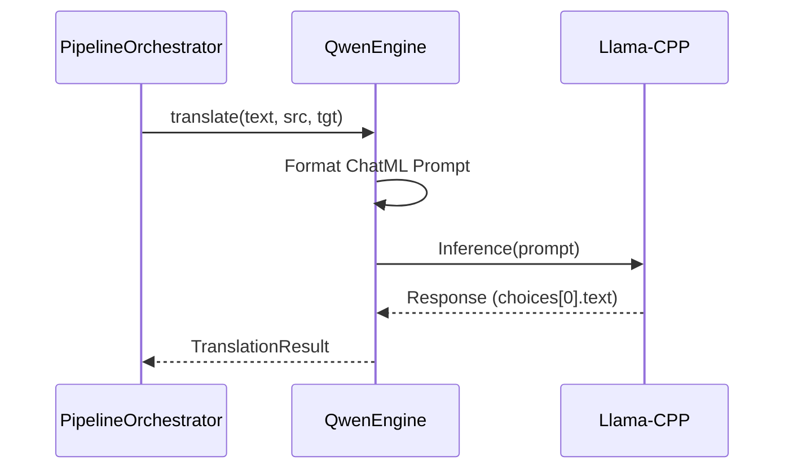

# Technical Design: Qwen2.5-7B-Instruct Integration

**Version:** 1.0
**Date:** 2026-02-12
**Author:** Gemini
**Related Documents:** [ADR-0007](docs/adr/ADR-0007-qwen-llm-integration.md), [DEV_SPEC-0007](docs/tasks/DEV_SPEC-0007-qwen-llm-integration.md)

---

### 1. Introduction

This document provides the technical design for integrating Qwen2.5-7B-Instruct as a core translation engine. It leverages `llama-cpp-python` for efficient inference and ensures seamless integration with the existing `PipelineOrchestrator`.

---

### 2. System Architecture and Components

#### 2.1. Component Overview

*   **`QwenEngine` (New Component):**
    *   Inherits from `LLMEngine`.
    *   Encapsulates `llama_cpp.Llama`.
    *   Handles ChatML prompt construction.
    *   Configurable via `model_path`, `n_ctx`, and `n_gpu_layers`.

*   **`Config` (Modified):**
    *   Updated to include `llm_type` (choice between "llama" and "qwen").
    *   Updated to allow model-specific paths.

*   **`PipelineOrchestrator` (Modified/Verified):**
    *   Should remain largely unchanged if the engine factory/initialization logic is abstracted.

#### 2.2. Component Interaction Diagram



---

### 3. Implementation Details

#### 3.1. Prompt Template (ChatML)

```python
SYSTEM_PROMPT = (
    "You are a professional theological translator. "
    "Translate the following text from {src_lang} to {tgt_lang}. "
    "Maintain biblical accuracy and terminology. "
    "Output ONLY the translated text without any explanations or filler."
)

PROMPT_TEMPLATE = (
    "<|im_start|>system
{system_prompt}<|im_end|>
"
    "<|im_start|>user
{text}<|im_end|>
"
    "<|im_start|>assistant
"
)
```

#### 3.2. Configuration Structure

```yaml
llm:
  engine_type: "qwen"  # or "llama"
  model_path: "models/qwen2.5-7b-instruct-q4_k_m.gguf"
  n_ctx: 2048
  n_gpu_layers: -1
```

---

### 4. Backend Specification

#### 4.1. File: `src/core/llm/qwen_engine.py`

*   **Class:** `QwenTranslator(LLMEngine)`
*   **Methods:**
    *   `__init__(self, model_path, n_ctx, n_gpu_layers)`
    *   `translate(self, text, src_lang, tgt_lang) -> TranslationResult`

#### 4.2. Factory Pattern (Optional but recommended)

A simple factory in `src/core/llm/__init__.py` or the configuration module will decide which engine to instantiate.

---

### 5. Security Considerations

*   **Model Origin:** Ensure GGUF files are downloaded from trusted sources (e.g., Hugging Face official or verified community quants like Bartowski or Unsloth).
*   **Local Execution:** No data leaves the local machine, ensuring privacy for theological sensitive content.

---

### 6. Performance Considerations

*   **GPU Offloading:** `n_gpu_layers: -1` will be used to maximize performance on NVIDIA hardware.
*   **Context Window:** 2048 tokens is sufficient for sentence-by-sentence translation.
*   **Quantization:** Q4_K_M provides a good balance between speed, size, and perplexity.
